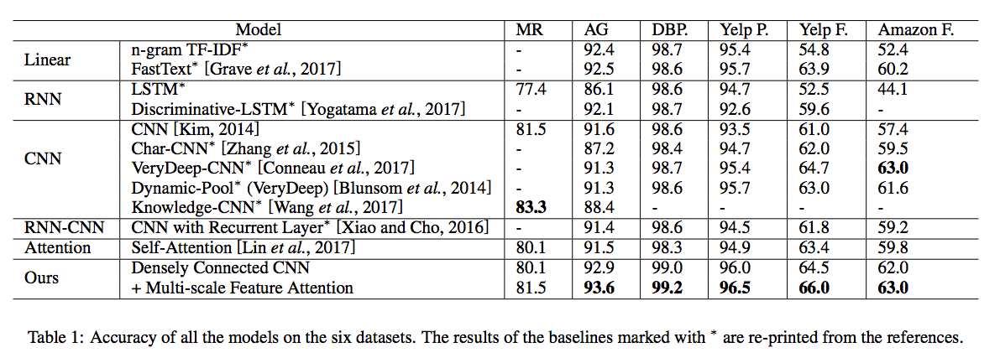

# Densely-Connected-CNN-with-Multi-scale-Feature-Attention
For Text Classification

## Introduction
**Densely Connected CNN with Multi-scale Feature Attention for Text Classification** is initially described in an [IJCAI-ECAI 2018 paper](https://wangshy31.github.io/papers/1-Densely_Connected_CNN_with_Multiscale_Feature_Attention.pdf). It provides a new CNN architecture to produce variable n-gram features. It is worth nothing that:

* It uses dense connections to build short-cut paths between upstream and downstream convolutional blocks, which enable the model to compose features of larger scale from those of smaller scale, and thus produce variable n-gram features.
* A multi-scale feature attention is developed to adaptively select multi-scale features for classification.
* It obtains competitive performance against state-of-the-art baselines on six benchmark datasets.

## Citation
If you find these models useful in your research, please consider citing:
```
@article{Wang2018Densely,
    title={Densely Connected CNN with Multi-scale Feature Attention for Text Classification},
    author={Wang, Shiyao and Huang, Minlie and Deng, Zhidong},
    conference={IJCAI-ECAI 2018, Stockholm, Sweden},
    year={2018}
}
```

## Preparation for Training & Testing
1. Please clone the Densely-Connected-CNN-with-Multiscale-Feature-Attention repository, and we call the directory that you cloned as ${DenseAttention_ROOT}.

2. please clone the Caffe from [caffe_for_text](https://github.com/wangshy31/caffe_for_text) and build it. It is a modified version of [the offical repository](https://github.com/BVLC/caffe).

3. Please download text classification datasets from [benchmark datasets](https://drive.google.com/drive/folders/0Bz8a_Dbh9Qhbfll6bVpmNUtUcFdjYmF2SEpmZUZUcVNiMUw1TWN6RDV3a0JHT3kxLVhVR2M) which are releasd by [Zhang et al., 2015](https://papers.nips.cc/paper/5782-character-level-convolutional-networks-for-text-classification.pdf). AGNews in `$(DenseAttention_ROOT)/data/ag_news_csv` is an example dataset in this repo.

4. Please download pretrained word vectors from [Glove](https://nlp.stanford.edu/projects/glove/).

## Usage

1. Prepare training & testing data by using original datasets, pretrained word vectors and tools in `$(DenseAttention_ROOT)/data/gen_data.py`.

2. Generate the training & testing prototxt by using tools in `$(DenseAttention_ROOT)/script/gen_model.py`.

3. To perform experiments, run the script with the corresponding config file as input. For example, to train and test, use the following command
    ```
    cd $(DenseAttention_ROOT)/experiment
    ./train.sh
    ```
    This example uses 4 NVIDIA Titan X Pascal GPUs and the trained model as well as logs are saved in `$(DenseAttention_ROOT)/experiment`.

4. Please find more details in config files and in our code.

## Main Results


